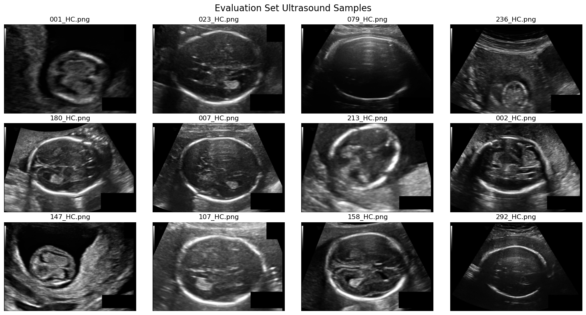

# Fetal Head Circumference: Ultrasound Data Exploration

## Problem

Fetal head circumference is an important biometric measurement in prenatal assessment. Before building an image-based estimator, the ultrasound files and clinical measurements must be inspected, matched, and validated carefully.

## Questions Answered

- How many metadata records are available and what measurements do they contain?
- Are the ultrasound files consistently named and linked to the correct metadata?
- What are the ranges of head circumference and pixel spacing?
- Are the images suitable for a consistent preprocessing pipeline?

## Dataset Snapshot

- **999** metadata rows in the supplied training metadata file
- Head-circumference range: **44.3–346.4 mm**
- Median head circumference: **174.06 mm**
- **335** image files matched during the current notebook run



## Work Completed

1. Loaded and validated measurement metadata.
2. Reviewed data types, missing values, and descriptive statistics.
3. Displayed representative ultrasound images with their measurements.
4. Matched available image filenames to the metadata records.
5. Documented considerations for future preprocessing and model development.

## Current Status

This is an **EDA and data-validation stage**. A trained head-circumference prediction model is not included yet, so no model accuracy or clinical-performance claim is made.

## Next Steps

- Standardize image dimensions and intensity values.
- Define a reproducible train/validation/test split.
- Establish a simple baseline model before deep-learning experiments.
- Evaluate prediction error in millimeters and examine clinically relevant failure cases.

## How to Run

```bash
pip install pandas numpy matplotlib pillow jupyter
jupyter notebook notebooks/EDA_fetal_HC_dataset.ipynb
```

## Responsible Use

This project is educational and exploratory. It is not a medical device and must not be used for diagnosis or clinical decision-making.


